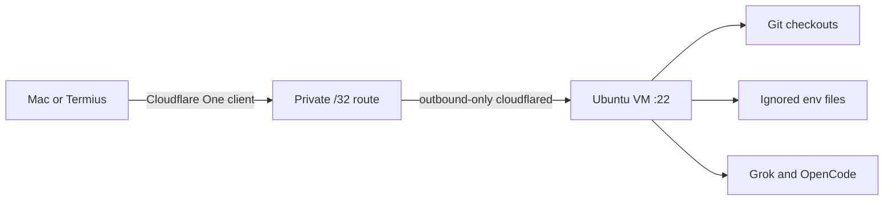

# Dotfiles

Personal macOS development environment configuration.

## Quick Start

```bash
# 1. Install Xcode Command Line Tools
xcode-select --install

# 2. Install Homebrew
/bin/bash -c "$(curl -fsSL https://raw.githubusercontent.com/Homebrew/install/HEAD/install.sh)"

# 3. Clone and install
git clone https://github.com/SomtoUgeh/dotfiles.git ~/code/personal/dotfiles
cd ~/code/personal/dotfiles
./install.sh

# 4. Rebuild SSH keys and commit signing from 1Password
./scripts/setup_ssh_from_1password.sh
# writes public keys, allowed_signers, ~/.ssh/config, gitconfig identities

# 5. Configure private settings
cp templates/zshrc-private.template ~/.zshrc.private
# Edit ~/.zshrc.private with your API keys

# 6. Apply macOS settings
./macos/defaults.sh

# 7. Restart terminal
exec zsh
```

## Directory Structure

The install script creates this folder layout:

```
~/
├── code/                    # All code projects (CDPATH enabled)
│   ├── personal/            # Personal identity (SomtoUgeh)
│   │   └── dotfiles/        # This repo
│   └── work/                # Swissblock identity (somto-swissblock)
├── bin/                     # Custom scripts (in PATH)
├── .git-hooks/              # -> git/hooks (global core.hooksPath)
├── .config/                 # XDG config home
└── .ssh/                    # Public keys only; private keys live in 1Password
```

**CDPATH** is configured so you can `cd projectname` from anywhere to jump to `~/code/projectname`.

## What's Included

### Shell
- **Zsh** with Oh My Zsh framework
- **Starship** prompt (cross-shell, fast)
- Plugins: fzf-tab, zsh-autosuggestions, fast-syntax-highlighting
- Custom aliases and functions

### Editors
- **VS Code** (primary) - settings, keybindings and extension list tracked
- **Zed** - fast native editor; extensions auto-install on first launch

### Terminal
- **Ghostty** - GPU-accelerated terminal
- **cmux** - multiplexer with an embedded Ghostty; installed by other tooling,
  not by the Brewfile

### Development Tools
- **fnm** - Fast Node Manager (chosen Node version manager)
- **uv** - Python package manager
- **rust** / **go** - language toolchains
- **ast-grep** - Structural code search
- **delta** - Better git diffs
- **direnv** - Per-directory environment variables
- **jq** - JSON processing (install.sh depends on it)

### CLI Utilities
- **eza** - Modern ls with icons
- **bat** - Better cat with syntax highlighting
- **fzf** - Fuzzy finder
- **ripgrep** - Fast grep
- **gh** - GitHub CLI

## Repository Structure

```
dotfiles/
├── install.sh              # Main installation script
├── Brewfile                # Homebrew packages
├── README.md
├── docs/
│   └── cloud-development-workspace.md
├── shell/                  # Shell configurations
│   ├── .zshrc
│   ├── .zshrc.cloud        # Ubuntu VM Zsh
│   ├── .zshenv
│   └── .zprofile
├── git/                    # Git configuration
│   ├── .gitconfig
│   ├── .gitignore_global
│   ├── SIGNING.md          # two-identity SSH signing setup
│   └── hooks/              # global hooks (worm guard pre-commit)
├── config/
│   ├── vscode/             # settings, keybindings, extensions.txt
│   ├── zed/                # settings and keymap
│   ├── ghostty/            # Ghostty terminal config
│   ├── cmux/               # cmux terminal config
│   ├── starship/           # Starship prompt config
│   └── gh/                 # GitHub CLI config
│       └── rulesets/       # branch protection JSON, applied by script
├── agents/                 # Claude, Codex, OpenCode, and shared skills
│   ├── shared/             # Shared AGENTS.md, ETHOS.md, hooks, MCP inventory
│   ├── claude/             # Claude Code config, commands, agents, plugins
│   ├── codex/              # Codex config and agents
│   ├── opencode/           # OpenCode config, including opencode.cloud.jsonc
│   └── skills/             # Shared SKILL.md packages via ~/.agents/skills
├── scripts/
│   ├── setup_ssh_from_1password.sh   # rebuild keys + signing from the vault
│   ├── scan_repo.sh                  # scan an untrusted repo before opening
│   ├── apply_github_rulesets.sh      # push branch protection to repos
│   ├── enable_touchid_sudo.sh
│   ├── setup_altschool_cloud.sh
│   ├── install_cloud_dotfiles.sh
│   └── verify_altschool_cloud.sh
├── macos/
│   └── defaults.sh         # macOS system preferences
└── templates/              # Templates for sensitive / machine-local files
    ├── zshrc-private.template
    ├── ssh-config.template              # Mac: 1Password agent, work default
    ├── ssh-config-cloud.template        # cloud worker: file-based key
    ├── gitconfig-local.template         # name only, no email
    ├── gitconfig-personal.template      # SomtoUgeh
    ├── gitconfig-work.template          # somto-swissblock
    ├── 1password-agent.toml.template    # which vaults the SSH agent serves
    ├── gh-hosts-personal.yml.template   # gh active account: SomtoUgeh
    ├── gh-hosts-work.yml.template       # gh active account: somto-swissblock
    ├── envrc-personal.template          # -> ~/code/personal/.envrc
    ├── envrc-work.template              # -> ~/code/work/.envrc
    ├── env.template
    └── aws-config.template
```

## Key Configurations

### Keyboard Speed
macOS defaults are too slow for coding. `macos/defaults.sh` sets:
- `KeyRepeat = 1` (fastest, 15ms between repeats)
- `InitialKeyRepeat = 15` (225ms before the repeat starts)

### Editor Keybindings
Shared across VS Code and Zed:
- `cmd+t` - Toggle terminal
- `shift+down/up` - Duplicate line
- `alt+up` - Move line up
- `alt+d` - Delete line
- `cmd+q cmd+f` - Quick text search

### Git
- Folder-driven identity via `includeIf` (`~/code/personal`, `~/code/work`, `~/code/TalentQL`)
- `user.useConfigOnly` so folders without a match fail instead of inventing an email
- Auto rebase on pull
- Delta pager for diffs
- Case-sensitive file handling
- Useful aliases: `a`, `c`, `p`, `l`, `rh`, `b`, `co`, `amend`, `undo`
- GitHub HTTPS credentials through `gh` on PATH (`!gh auth git-credential`)
- Cloud worker: personal SSH key at `~/.ssh/id_ed25519_personal`, `commit.gpgsign` in `~/.gitconfig-personal` so every includeIf checkout signs

### GitHub CLI accounts
Two GitHub accounts, one per code root. A Zsh directory hook picks the account
by folder, the same way `includeIf` picks the git identity. It runs after
`direnv`, so a repository's own `.envrc` cannot silently select the wrong
account.

| Folder | gh account | `GH_CONFIG_DIR` |
|---|---|---|
| `~/code/personal` | `SomtoUgeh` | `~/.config/gh-personal` |
| `~/code/TalentQL` | `SomtoUgeh` | `~/.config/gh-personal` |
| `~/code/work` | `somto-swissblock` | `~/.config/gh-work` |
| anywhere else | whatever `gh auth switch` last set | `~/.config/gh` |

`gh` reads its whole config from `$GH_CONFIG_DIR`, so a separate dir per
account is what makes "active account" a per-directory fact. Each dir holds a
`hosts.yml` naming one active user, plus a symlink to the shared `config.yml`.

Tokens are not duplicated. They stay in the macOS keychain under service
`gh:github.com`, keyed by username, and every config dir reads the same ones.
So `gh auth login` once per account and both folders work.

Check it:
```bash
cd ~/code/personal && gh api user --jq .login   # SomtoUgeh
cd ~/code/work     && gh api user --jq .login   # somto-swissblock
```

## Manual Steps

### After Installation

1. **SSH keys** - Do not run `ssh-keygen`. Private keys live in 1Password and
   never touch the disk. One script rebuilds everything on a new machine:
   ```bash
   ./scripts/setup_ssh_from_1password.sh          # --check to preview
   ```
   It writes five public keys (four GitHub keys plus the AltSchool VM key),
   `~/.ssh/allowed_signers`, `~/.ssh/config`
   and the gitconfig identity files. See [`git/SIGNING.md`](git/SIGNING.md).

2. **Git Identity** - Folder-driven, not a global email. Copy the local files
   (included by `git/.gitconfig`):
   ```bash
   cp templates/gitconfig-local.template ~/.gitconfig.local
   cp templates/gitconfig-personal.template ~/.gitconfig-personal
   cp templates/gitconfig-work.template ~/.gitconfig-work
   cp templates/ssh-config.template ~/.ssh/config
   mkdir -p ~/.config/1Password/ssh
   cp templates/1password-agent.toml.template ~/.config/1Password/ssh/agent.toml
   # Mac work identity is ~/.gitconfig-work (not tracked). Add signing keys
   # and SSH insteadOf rewrites only on machines that have those keys.
   ```

3. **direnv** - `install.sh` creates `~/code/personal/.envrc` and
   `~/code/work/.envrc` when they do not already exist. It preserves customized
   files. Direnv will not load a new `.envrc` until you approve it:
   ```bash
   direnv allow ~/code/personal
   direnv allow ~/code/work
   ```
   Do not add a `whitelist` block to `~/.config/direnv/direnv.toml` for these
   roots. That would auto-run the `.envrc` of any repo you clone under them.

4. **Private Config** - Add API keys to `~/.zshrc.private`
   (includes `RESEND_API_KEY` and any others from `templates/zshrc-private.template`)

### App Store Apps
Most App Store apps (Xcode, Pages, Keynote, WhatsApp, etc.) are installed
automatically via `mas` in the Brewfile — **sign in to the App Store first**.
See `macos/apps.md` for the full inventory, including the few apps that must be
downloaded manually (e.g. Dia browser).

### Browser Extensions
Install from respective stores after browser setup.

## Security

Defences against a repo you did not write. Prompted by a real git config
injection worm, which hid a payload behind 50+ spaces in an interpreted config
file and used `.vscode/tasks.json` with `runOn: folderOpen` to run it.

### Scan before you open

```bash
scan_repo.sh /path/to/untrusted-repo     # 14 checks
scan_repo.sh --selftest                  # 12/12 must fire against a known sample
```

The checks cover the dropper (`.vscode` folderOpen tasks, a task running `node`
against a `.woff2`, fake font magic bytes), the payload (50+ space padding,
`global.i="A8-3997-1"` and friends, Unicode-escaped `require`, `createRequire`
prepended to ESM), the C2 endpoints, the worm's `.gitignore` edits including the
line that hides itself, the malicious npm dependency, a leaked `gho_` OAuth
token, and two git-history checks — known dropper blob SHAs, and the
author/committer timezone mismatch that marks a server-side rewrite.

A detector contains the strings it detects. Any file carrying the marker
`worm-guard:allow-signatures` is skipped, and the IOC literals in the scanner
and the hook are assembled from fragments so they do not trip other people's
scanners either.

Run it before opening an unfamiliar repo in an editor.

**It only sees local clones.** In the documented incident 23 of 42 infected
repositories had no local copy, and the local scanner said CLEAN every round —
truthfully. The laptop was never infected. The GitHub repositories were.
Enumerate from the GitHub API, not from disk.

### Global pre-commit guard

`git/hooks/` is symlinked to `~/.git-hooks` and set as `core.hooksPath`, so the
guard runs in every repo. It scans staged content for injection markers and
padded payloads, then chains to the repo's own `pre-commit` if one exists.

- Setting `core.hooksPath` globally disables repo-local hook paths. The chain
  at the end of the guard is what keeps repo hooks working.
- A legitimate file that trips the padding check can opt out with the marker
  `worm-guard:allow-signatures`.

### Branch protection

```bash
apply_github_rulesets.sh --repo dotfiles          # dry run, the default
apply_github_rulesets.sh --repo dotfiles --apply
apply_github_rulesets.sh --all --apply            # every repo you admin
```

Applies `config/gh/rulesets/*.json` to your repos: block force-push, block
branch deletion, require signed commits. Safe to run twice — it looks the
ruleset up by name and updates in place. Archived repos are reported, not
retried. Private repos need a paid GitHub plan.

### Editor hardening

VS Code `settings.json` keeps `task.allowAutomaticTasks: "off"` and
`security.workspace.trust.untrustedFiles: "prompt"`. Both block the worm's
folder-open path. Do not relax them.

## Updating

```bash
cd ~/code/personal/dotfiles
git pull
./install.sh  # Re-run to update symlinks
```

## Cloud Development VM

Private Ubuntu worker. No public inbound path. Cloudflare One routes a
private `/32` through an outbound-only tunnel. The Mac is the infrastructure
control plane. The VM is a replaceable worker with Git checkouts, ignored
application environment files, Grok, and OpenCode.



**Daily path:** Cloudflare One shows Connected → `ssh altschool` →
`tmux new -As development` → `talentql`. When local web ports are needed,
start one separate `ssh altschool-tunnel` session; it forwards the application
ports `5050` and `8000–8007` to the Mac. Bind development servers to
`127.0.0.1`.

The runbook is the source of truth (current host, security, rebuild,
migration, cost, recovery):

[Cloud Development Workspace Runbook](docs/cloud-development-workspace.md) ·
[Daily](docs/cloud-development-workspace.md#daily-access) ·
[Verify](docs/cloud-development-workspace.md#verification) ·
[Rebuild](docs/cloud-development-workspace.md#build-or-rebuild-a-host) ·
[Troubleshoot](docs/cloud-development-workspace.md#troubleshooting)

```bash
./scripts/setup_altschool_cloud.sh
./scripts/setup_altschool_cloud.sh --auth
./scripts/setup_altschool_cloud.sh --update --auth --repo OWNER/REPO
./scripts/verify_altschool_cloud.sh --require-auth --smoke
```

## Troubleshooting

### Zsh completion issues
```bash
rm -f ~/.zcompdump*
exec zsh
```

### Keyboard speed not applied
Log out and back in, or restart the Mac.

### Symlinks not working
```bash
rm ~/.zshrc  # Remove existing file
./install.sh  # Re-run install
```

## Portable agent configs (Mac -> WSL / other machines)

`install.sh` keeps host-specific paths out of the tracked files:

- `~/.codex/config.toml` and `~/.codex/hooks.json` are rendered from `agents/codex/` with `/Users/<user>` values replaced by `$HOME`.
- `~/.claude/settings.json` is **symlinked** to `agents/claude/settings.json`. It uses `${HOME}`-relative paths, and Claude resolves the link and writes through it, so the tracked copy always reflects live config and never drifts.

Claude's `installed_plugins.json` / `known_marketplaces.json` are machine-generated caches (absolute paths, timestamps, commit SHAs) and are intentionally **not** tracked. They are rebuilt from `enabledPlugins` + `extraKnownMarketplaces` in `settings.json`, which is the single source of truth for plugins — `install.sh` installs them from there, and Claude re-syncs on launch.

## Commit signing

SSH commit signing with two identities (personal / Swissblock), keys held in
1Password. Setup, accepted policy deviations and rebuild steps:
[`git/SIGNING.md`](git/SIGNING.md).
