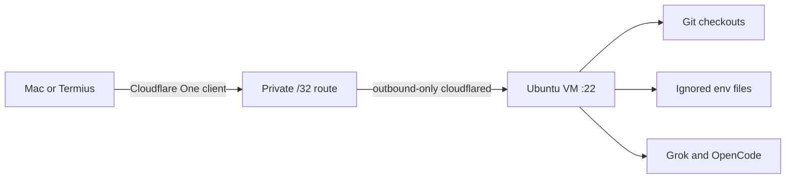

# Dotfiles

Personal macOS development environment configuration.

## Quick Start

```bash
# 1. Install Xcode Command Line Tools
xcode-select --install

# 2. Install Homebrew
/bin/bash -c "$(curl -fsSL https://raw.githubusercontent.com/Homebrew/install/HEAD/install.sh)"

# 3. Clone and install
git clone https://github.com/SomtoUgeh/dotfiles.git ~/code/personal/dotfiles
cd ~/code/personal/dotfiles
./install.sh

# 4. Rebuild SSH keys and commit signing from 1Password
./scripts/setup_ssh_from_1password.sh
# writes public keys, allowed_signers, ~/.ssh/config, gitconfig identities

# 5. Configure private settings
cp templates/zshrc-private.template ~/.zshrc.private
# Edit ~/.zshrc.private with your API keys

# 6. Apply macOS settings
./macos/defaults.sh

# 7. Restart terminal
exec zsh
```

## Directory Structure

The install script creates this folder layout:

```
~/
├── code/                    # All code projects (CDPATH enabled)
│   ├── personal/            # Personal identity (SomtoUgeh)
│   │   └── dotfiles/        # This repo
│   └── work/                # Swissblock identity (somto-swissblock)
├── bin/                     # Custom scripts (in PATH)
├── .config/                 # XDG config home
└── .ssh/                    # Public keys only; private keys live in 1Password
```

**CDPATH** is configured so you can `cd projectname` from anywhere to jump to `~/code/projectname`.

## What's Included

### Shell
- **Zsh** with Oh My Zsh framework
- **Starship** prompt (cross-shell, fast)
- Plugins: fzf-tab, zsh-autosuggestions, fast-syntax-highlighting
- Custom aliases and functions

### Editors
- **VS Code** (primary) - settings, keybindings and extension list tracked
- **Zed** - fast native editor; extensions auto-install on first launch

### Terminal
- **Ghostty** - GPU-accelerated terminal
- **cmux** - multiplexer with an embedded Ghostty; installed by other tooling,
  not by the Brewfile

### Development Tools
- **fnm** - Fast Node Manager (chosen Node version manager)
- **uv** - Python package manager
- **rust** / **go** - language toolchains
- **ast-grep** - Structural code search
- **delta** - Better git diffs
- **direnv** - Per-directory environment variables
- **jq** - JSON processing (install.sh depends on it)

### CLI Utilities
- **eza** - Modern ls with icons
- **bat** - Better cat with syntax highlighting
- **fzf** - Fuzzy finder
- **ripgrep** - Fast grep
- **gh** - GitHub CLI

## Repository Structure

```
dotfiles/
├── install.sh              # Main installation script
├── Brewfile                # Homebrew packages
├── README.md
├── docs/
│   └── cloud-development-workspace.md
├── shell/                  # Shell configurations
│   ├── .zshrc
│   ├── .zshrc.cloud        # Ubuntu VM Zsh
│   ├── .zshenv
│   └── .zprofile
├── git/                    # Git configuration
│   ├── .gitconfig
│   ├── .gitignore_global
│   └── SIGNING.md          # two-identity SSH signing setup
├── config/
│   ├── vscode/             # settings, keybindings, extensions.txt
│   ├── zed/                # settings and keymap
│   ├── ghostty/            # Ghostty terminal config
│   ├── cmux/               # cmux terminal config
│   ├── starship/           # Starship prompt config
│   └── gh/                 # GitHub CLI config
│       └── rulesets/       # branch protection JSON, applied by script
├── agents/                 # Claude, Codex, OpenCode, and shared skills
│   ├── shared/             # Shared AGENTS.md, ETHOS.md, hooks, MCP inventory
│   ├── claude/             # Claude Code config, commands, agents, plugins
│   ├── codex/              # Codex config and agents
│   ├── opencode/           # OpenCode config, including opencode.cloud.jsonc
│   └── skills/             # Shared SKILL.md packages via ~/.agents/skills
├── scripts/
│   ├── setup_ssh_from_1password.sh   # rebuild keys + signing from the vault
│   ├── scan_repo.sh                  # scan an untrusted repo before opening
│   ├── scan_remote.sh                # inspect GitHub contents without cloning
│   ├── apply_github_rulesets.sh      # push branch protection to repos
│   ├── enable_touchid_sudo.sh
│   ├── setup_altschool_cloud.sh
│   ├── install_cloud_dotfiles.sh
│   └── verify_altschool_cloud.sh
├── tests/                  # Scanner, installer and agent regression tests
├── macos/
│   └── defaults.sh         # macOS system preferences
└── templates/              # Templates for sensitive / machine-local files
    ├── zshrc-private.template
    ├── ssh-config.template              # Mac: 1Password agent, work default
    ├── ssh-config-cloud.template        # cloud worker: file-based key
    ├── gitconfig-local.template         # name only, no email
    ├── gitconfig-personal.template      # SomtoUgeh
    ├── gitconfig-work.template          # somto-swissblock
    ├── 1password-agent.toml.template    # which vaults the SSH agent serves
    ├── gh-hosts-personal.yml.template   # gh active account: SomtoUgeh
    ├── gh-hosts-work.yml.template       # gh active account: somto-swissblock
    ├── envrc-personal.template          # -> ~/code/personal/.envrc
    └── envrc-work.template              # -> ~/code/work/.envrc
```

## Key Configurations

### Keyboard Speed
macOS defaults are too slow for coding. `macos/defaults.sh` sets:
- `KeyRepeat = 1` (fastest, 15ms between repeats)
- `InitialKeyRepeat = 15` (225ms before the repeat starts)

### Editor Keybindings
Shared across VS Code and Zed:
- `cmd+t` - Toggle terminal
- `shift+down/up` - Duplicate line
- `alt+up` - Move line up
- `alt+d` - Delete line
- `cmd+q cmd+f` - Quick text search

### Git
- Folder-driven identity via `includeIf` (`~/code/personal`, `~/code/work`, `~/code/TalentQL`)
- `user.useConfigOnly` so folders without a match fail instead of inventing an email
- Auto rebase on pull
- Delta pager for diffs
- Case-sensitive file handling
- Useful aliases: `a`, `c`, `p`, `l`, `rh`, `b`, `co`, `amend`, `undo`
- GitHub HTTPS credentials through `gh` on PATH (`!gh auth git-credential`)
- Cloud worker: personal SSH key at `~/.ssh/id_ed25519_personal`, `commit.gpgsign` in `~/.gitconfig-personal` so every includeIf checkout signs

### GitHub CLI accounts
Two GitHub accounts, one per code root. A Zsh directory hook picks the account
by folder, the same way `includeIf` picks the git identity. It runs after
`direnv`, so a repository's own `.envrc` cannot silently select the wrong
account.

| Folder | gh account | `GH_CONFIG_DIR` |
|---|---|---|
| `~/code/personal` | `SomtoUgeh` | `~/.config/gh-personal` |
| `~/code/TalentQL` | `SomtoUgeh` | `~/.config/gh-personal` |
| `~/code/work` | `somto-swissblock` | `~/.config/gh-work` |
| anywhere else | whatever `gh auth switch` last set | `~/.config/gh` |

`gh` reads its whole config from `$GH_CONFIG_DIR`, so a separate dir per
account is what makes "active account" a per-directory fact. Each dir holds a
`hosts.yml` naming one active user, plus a symlink to the shared `config.yml`.

Tokens are not duplicated. They stay in the macOS keychain under service
`gh:github.com`, keyed by username, and every config dir reads the same ones.
So `gh auth login` once per account and both folders work.

Check it:
```bash
cd ~/code/personal && gh api user --jq .login   # SomtoUgeh
cd ~/code/work     && gh api user --jq .login   # somto-swissblock
```

## Manual Steps

### After Installation

1. **SSH keys** - Do not run `ssh-keygen`. Private keys live in 1Password and
   never touch the disk. One script rebuilds everything on a new machine:
   ```bash
   ./scripts/setup_ssh_from_1password.sh          # --check to preview
   ```
   It writes five public keys (four GitHub keys plus the AltSchool VM key),
   `~/.ssh/allowed_signers`, `~/.ssh/config`
   and the gitconfig identity files. See [`git/SIGNING.md`](git/SIGNING.md).

2. **Git Identity** - Folder-driven, not a global email. Copy the local files
   (included by `git/.gitconfig`):
   ```bash
   cp templates/gitconfig-local.template ~/.gitconfig.local
   cp templates/gitconfig-personal.template ~/.gitconfig-personal
   cp templates/gitconfig-work.template ~/.gitconfig-work
   cp templates/ssh-config.template ~/.ssh/config
   mkdir -p ~/.config/1Password/ssh
   cp templates/1password-agent.toml.template ~/.config/1Password/ssh/agent.toml
   # Mac work identity is ~/.gitconfig-work (not tracked). Add signing keys
   # and SSH insteadOf rewrites only on machines that have those keys.
   ```

3. **direnv** - `install.sh` creates `~/code/personal/.envrc` and
   `~/code/work/.envrc` when they do not already exist. It preserves customized
   files. Direnv will not load a new `.envrc` until you approve it:
   ```bash
   direnv allow ~/code/personal
   direnv allow ~/code/work
   ```
   Do not add a `whitelist` block to `~/.config/direnv/direnv.toml` for these
   roots. That would auto-run the `.envrc` of any repo you clone under them.

4. **Private Config** - Add API keys to `~/.zshrc.private`
   (includes `RESEND_API_KEY` and any others from `templates/zshrc-private.template`)

### App Store Apps
Most App Store apps (Xcode, Pages, Keynote, WhatsApp, etc.) are installed
automatically via `mas` in the Brewfile — **sign in to the App Store first**.
See `macos/apps.md` for the full inventory, including the few apps that must be
downloaded manually (e.g. Dia browser).

### Browser Extensions
Install from respective stores after browser setup.

## Repository scanning

### New-machine setup

`install.sh` installs the manual scanner commands in `~/bin`, together with
Git, uv and Python through the Brewfile. The Ubuntu installer installs the two
scanners in `~/.local/bin` and supplies Python and uv. Both require Python 3.9
or newer. Tests and helper modules
stay in the repository. Neither installer enables monitoring or global Git
scan hooks. Normal commits, pulls and builds use the project's own workflow.

VS Code keeps workspace trust enabled and automatic tasks disabled. Review
individual repositories before trusting them; trusting a parent directory also
trusts future clones. Manually starting a build still executes repository code.

### One-time manual scans

```bash
scan_repo.sh /absolute/path/to/repository
scan_remote.sh --account personal --repo OWNER/REPO --ref COMMIT_SHA
scan_remote.sh --account personal --repo OWNER/REPO
```

### Standalone curl scans

People without these dotfiles can download and run just the scanner:

```bash
# Local folder, including any locally stored Git history
(set -o pipefail; curl -fsSL https://raw.githubusercontent.com/SomtoUgeh/dotfiles/main/scripts/scan.sh | bash -s -- local /path/to/repo)

# All current branch and tag tips in a GitHub repository
(set -o pipefail; curl -fsSL https://raw.githubusercontent.com/SomtoUgeh/dotfiles/main/scripts/scan.sh | bash -s -- repo OWNER/REPO)

# One branch, tag or commit
(set -o pipefail; curl -fsSL https://raw.githubusercontent.com/SomtoUgeh/dotfiles/main/scripts/scan.sh | bash -s -- repo OWNER/REPO --ref main)

# Also read untracked build caches and show more review locations
(set -o pipefail; curl -fsSL https://raw.githubusercontent.com/SomtoUgeh/dotfiles/main/scripts/scan.sh | bash -s -- local /path/to/repo --include-generated --details)
```

Run these from a trusted terminal. The downloaded script is executable code
from this repository; inspect `scripts/scan.sh` first if needed. `pipefail`
keeps an initial curl failure from returning success. The bootstrap downloads
all four scanner files into a temporary directory and checks their SHA-256
digests before loading them. A failed or mismatched download stops the run.
It removes the temporary scripts on exit and preserves the scanner's exit code.

Setup installs missing dependencies using Homebrew on macOS (installing
Homebrew if absent), apt on Debian/Ubuntu, or dnf on Fedora. It may request an
administrator password. Git and Python 3.9+ are needed for local scans; remote
scans also need GitHub CLI, jq, file and iconv. Linux setup installs a pinned uv
release in `~/.local/bin` using its official installer. Installed dependencies
remain available afterward. Other Linux distributions can run the scanner
when these dependencies are already installed in the standard locations.
The bootstrap requires Bash, curl and sha256sum or shasum to start.

Remote scans use your normal `gh` configuration or `GH_TOKEN`/`GITHUB_TOKEN`.
On an interactive terminal, missing authentication starts GitHub's browser
login. For unattended use, provide a token with read access to the target repo.
You can use this mode directly with
`scan_remote.sh --account default --repo OWNER/REPO`.

Installer references: [Homebrew](https://brew.sh/),
[uv installer options](https://docs.astral.sh/uv/reference/installer/), and
[GitHub CLI login](https://cli.github.com/manual/gh_auth_login).

When changing a shipped scanner or helper, update its SHA-256 digest in
`scripts/scan.sh` in the same commit. `tests/test_scan_bootstrap.sh` checks
that the embedded digests match the source files.

The local scanner reads the working tree and available Git objects as data.
Dependencies, unreadable files, oversized files and missing shallow history are
reported scope limits; inspect the report. It runs Python through uv with
project discovery, environment-file loading and downloads disabled. The remote
scanner uses GitHub GET requests, verifies blob hashes and sizes, and never
clones or executes the repository. Both use the same detection rules.

Local scans print a start message immediately and progress every five seconds,
including the current phase and file. By default, untracked files under `.next`,
`.nuxt`, `.svelte-kit`, `.turbo`, and `.parcel-cache` are outside the scan scope;
the report lists the excluded directories. Tracked paths, locally stored Git
objects, and nested repositories are still inspected. Arbitrary `.gitignore`
entries do not exclude source files. Use `--include-generated` to read those
build caches too; oversized or changing files can make that scan incomplete.
Dependency exclusions still apply. Ctrl+C reports an interrupted, incomplete
scan without a Python traceback.

The local report starts with campaign matches, review signals, and inspection
errors as separate counts. Exact campaign markers are distinguished from generic
patterns such as long lines, public blockchain endpoints, and active Git hooks.
Neither category proves execution or infection. Review groups show three example
locations by default; `--details` shows up to 20 per group. Counts include all
matches, even when the list is capped. These options also work directly with
`scan_repo.sh /path/to/repo --include-generated --details`.

Exit codes: **0 = requested checks completed without findings; 1 = campaign matches or review signals;
2 = incomplete.** A signature match needs investigation; it does not prove
execution or machine compromise. An incomplete scan is not a clean verdict.
Even a completed scan covers known indicators within its stated scope, not
all malware. Remote scans exclude full commit history, native binary internals,
LFS contents and unrequested pull request refs. Explicit `--ref` scans cover
only that ref. Findings show paths and locations without secret values.

Remote reports live in `~/.local/state/worm-guard`; the local scanner prints
to the terminal, so redirect its output there when preserving a report. Keep
incident evidence separate from dotfiles. `WORMGUARD_STATE` selects another state directory for
an isolated investigation. Remote receipts are in `scan-last-run.json`.
Scanner changes can be checked offline from this checkout:

```bash
./tests/test_scan_repo.sh
./tests/test_scan_remote.sh
./tests/test_scan_bootstrap.sh
./tests/test_scanner_install.sh
uv run --no-project python tests/test_worm_guard_patterns.py
uv run --no-project python tests/test_scan_progress.py
uv run --no-project python tests/test_scan_scope.py
```

### Manual inventory scans

To scan a selected set of repositories, create
`~/.local/state/worm-guard/repos.tsv` with only repositories you own or are
responsible for, one account and repository separated by a literal tab:

```text
personal	SomtoUgeh/dotfiles
```

`scan_remote.sh` scans every current branch/tag tip in this inventory by default. Missing or empty inventory
is incomplete; it never silently expands to all accessible repositories.
`WORMGUARD_REPOS_FILE` selects another inventory. For a deliberate one-time
account-wide investigation, `--all-readable` adds accessible repositories.
Do not include repositories whose remediation belongs to another team without
agreeing that scope with them.

Run the inventory scan explicitly and review its coverage:

```bash
scan_remote.sh
```

Scanning is manual. There is no scheduled monitor or health reminder to install.

### GitHub account/repository setup

Branch rulesets are server-side administration, applied once per repository
and revisited when policy changes. They are unrelated to setting up a new Mac
and are not malware checks. The two definitions serve different purposes:
force-push/deletion protection and verified commit signatures. See
[the ruleset instructions](config/gh/rulesets/README.md) and
[signing setup](git/SIGNING.md).

```bash
apply_github_rulesets.sh --repo dotfiles          # dry run
apply_github_rulesets.sh --repo dotfiles --apply  # deliberately update policy
```

The scanner's `--account ci --repo OWNER/REPO --ref COMMIT_SHA` interface
accepts an installation token in `GH_TOKEN`; no CI workflow is installed.
A required malware check needs a trusted scanner and protected workflow
inspecting the proposed immutable commit as data. Review deploy keys and
write-capable integrations separately: other collaborators or CI can
reintroduce compromised content.

## Updating

```bash
cd ~/code/personal/dotfiles
git pull
./install.sh  # Re-run to update symlinks
```

## Cloud Development VM

Private Ubuntu worker. No public inbound path. Cloudflare One routes a
private `/32` through an outbound-only tunnel. The Mac is the infrastructure
control plane. The VM is a replaceable worker with Git checkouts, ignored
application environment files, Grok, and OpenCode.



**Daily path:** Cloudflare One shows Connected → `ssh altschool` →
`tmux new -As development` → `talentql`. When local web ports are needed,
start one separate `ssh altschool-tunnel` session; it forwards the application
ports `5050` and `8000–8007` to the Mac. Bind development servers to
`127.0.0.1`.

The runbook is the source of truth (current host, security, rebuild,
migration, cost, recovery):

[Cloud Development Workspace Runbook](docs/cloud-development-workspace.md) ·
[Daily](docs/cloud-development-workspace.md#daily-access) ·
[Verify](docs/cloud-development-workspace.md#verification) ·
[Rebuild](docs/cloud-development-workspace.md#build-or-rebuild-a-host) ·
[Troubleshoot](docs/cloud-development-workspace.md#troubleshooting)

```bash
./scripts/setup_altschool_cloud.sh
./scripts/setup_altschool_cloud.sh --auth
./scripts/setup_altschool_cloud.sh --update --auth --repo OWNER/REPO
./scripts/verify_altschool_cloud.sh --require-auth --smoke
```

## Troubleshooting

### Zsh completion issues
```bash
rm -f ~/.zcompdump*
exec zsh
```

### Keyboard speed not applied
Log out and back in, or restart the Mac.

### Symlinks not working
```bash
rm ~/.zshrc  # Remove existing file
./install.sh  # Re-run install
```

## Portable agent configs (Mac -> WSL / other machines)

`install.sh` keeps host-specific paths out of the tracked files:

- `~/.codex/config.toml` stays host-local. The agent sync script adds missing defaults and refreshes managed hooks while preserving local settings and backing up changes; see [agent setup](agents/README.md).
- `~/.claude/settings.json` is **symlinked** to `agents/claude/settings.json`. It uses `${HOME}`-relative paths, and Claude resolves the link and writes through it, so the tracked copy always reflects live config and never drifts.

Claude's `installed_plugins.json` / `known_marketplaces.json` are machine-generated caches (absolute paths, timestamps, commit SHAs) and are intentionally **not** tracked. They are rebuilt from `enabledPlugins` + `extraKnownMarketplaces` in `settings.json`, which is the single source of truth for plugins — `install.sh` installs them from there, and Claude re-syncs on launch.

## Commit signing

SSH commit signing with two identities (personal / Swissblock), keys held in
1Password. Setup, accepted policy deviations and rebuild steps:
[`git/SIGNING.md`](git/SIGNING.md).
