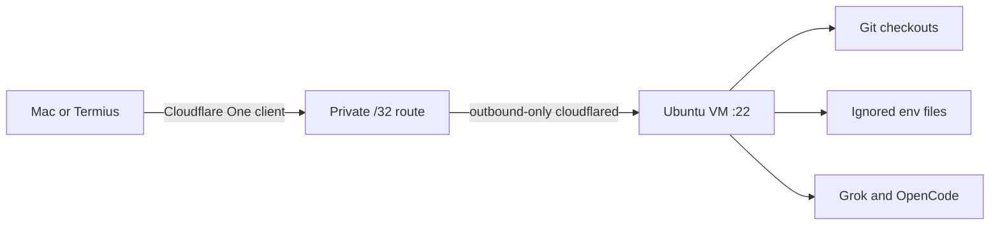

# Dotfiles

Personal macOS development environment configuration.

## Quick Start

```bash
# 1. Install Xcode Command Line Tools
xcode-select --install

# 2. Install Homebrew
/bin/bash -c "$(curl -fsSL https://raw.githubusercontent.com/Homebrew/install/HEAD/install.sh)"

# 3. Clone and install
git clone https://github.com/SomtoUgeh/dotfiles.git ~/code/personal/dotfiles
cd ~/code/personal/dotfiles
./install.sh

# 4. Configure private settings
cp templates/zshrc-private.template ~/.zshrc.private
# Edit ~/.zshrc.private with your API keys

# 5. Apply macOS settings
./macos/defaults.sh

# 6. Restart terminal
exec zsh
```

## Directory Structure

The install script creates this folder layout:

```
~/
├── code/                    # All code projects (CDPATH enabled)
│   ├── myrepo/              # Main repo
│   └── myrepo--feature/     # Worktree (git worktree add)
├── bin/                     # Custom scripts (in PATH)
├── Pictures/Screenshots/    # macOS screenshots location
├── .config/                 # XDG config home
└── .ssh/                    # SSH keys (700 permissions)
```

**CDPATH** is configured so you can `cd projectname` from anywhere to jump to `~/code/projectname`.

## What's Included

### Shell
- **Zsh** with Oh My Zsh framework
- **Starship** prompt (cross-shell, fast)
- Plugins: fzf-tab, zsh-autosuggestions, fast-syntax-highlighting
- Custom aliases and functions

### Editors
- **Cursor** (primary) - AI-powered VSCode fork
- **Zed** - Fast, modern editor
- **VSCode** - Shares config with Cursor

### Terminal
- **Ghostty** - GPU-accelerated terminal
- **iTerm2** - Backup terminal

### Development Tools
- **fnm** - Fast Node Manager (chosen Node version manager)
- **uv** - Python package manager
- **rust** / **go** - language toolchains
- **ast-grep** - Structural code search
- **delta** - Better git diffs
- **graphite** - Stacked PRs CLI
- **direnv** - Per-directory environment variables

### CLI Utilities
- **eza** - Modern ls with icons
- **bat** - Better cat with syntax highlighting
- **fzf** - Fuzzy finder
- **ripgrep** - Fast grep
- **gh** - GitHub CLI

## Repository Structure

```
dotfiles/
├── install.sh              # Main installation script
├── Brewfile                # Homebrew packages
├── README.md
├── docs/
│   └── cloud-development-workspace.md
├── shell/                  # Shell configurations
│   ├── .zshrc
│   ├── .zshrc.cloud        # Ubuntu VM Zsh
│   ├── .zshenv
│   └── .zprofile
├── git/                    # Git configuration
│   ├── .gitconfig
│   └── .gitignore_global
├── config/
│   ├── cursor/             # Cursor/VSCode settings
│   ├── ghostty/            # Ghostty terminal config
│   ├── starship/           # Starship prompt config
│   ├── zed/                # Zed editor settings
│   └── gh/                 # GitHub CLI config
├── agents/                 # Claude, Codex, OpenCode, and shared skills
│   ├── shared/             # Shared AGENTS.md, ETHOS.md, hooks, MCP inventory
│   ├── claude/             # Claude Code config, commands, agents, plugins
│   ├── codex/              # Codex config and agents
│   ├── opencode/           # OpenCode config, including opencode.cloud.jsonc
│   └── skills/             # Shared SKILL.md packages via ~/.agents/skills
├── scripts/
│   ├── enable_touchid_sudo.sh
│   ├── setup_altschool_cloud.sh
│   ├── install_cloud_dotfiles.sh
│   └── verify_altschool_cloud.sh
├── macos/
│   └── defaults.sh         # macOS system preferences
└── templates/              # Templates for sensitive / machine-local files
    ├── zshrc-private.template
    ├── ssh-config.template              # Mac: 1Password agent, work default
    ├── ssh-config-cloud.template        # cloud worker: file-based key
    ├── gitconfig-local.template         # name only, no email
    ├── gitconfig-personal.template      # SomtoUgeh
    ├── gitconfig-work.template          # somto-swissblock
    ├── 1password-agent.toml.template    # which vaults the SSH agent serves
    ├── env.template
    └── aws-config.template
```

## Key Configurations

### Keyboard Speed
macOS defaults are too slow for coding. `macos/defaults.sh` sets:
- `KeyRepeat = 1` (fastest, 15ms between repeats)
- `InitialKeyRepeat = 15` (shortest delay before repeat)

### Editor Keybindings
Shared across Cursor/VSCode/Zed:
- `cmd+t` - Toggle terminal
- `shift+down/up` - Duplicate line
- `alt+up` - Move line up
- `alt+d` - Delete line
- `cmd+q cmd+f` - Quick text search

### Git
- Folder-driven identity via `includeIf` (`~/code/personal`, `~/code/work`, `~/code/TalentQL`)
- `user.useConfigOnly` so folders without a match fail instead of inventing an email
- Auto rebase on pull
- Delta pager for diffs
- Case-sensitive file handling
- Useful aliases: `a`, `c`, `p`, `l`, `rh`, `b`, `co`, `amend`, `undo`
- GitHub HTTPS credentials through `gh` on PATH (`!gh auth git-credential`)
- Cloud worker: personal SSH key at `~/.ssh/id_ed25519_personal`, `commit.gpgsign` in `~/.gitconfig-personal` so every includeIf checkout signs

## Manual Steps

### After Installation

1. **SSH Keys** - Copy from old machine or generate new:
   ```bash
   ssh-keygen -t ed25519 -C "your_email@example.com"
   ssh-add --apple-use-keychain ~/.ssh/id_ed25519
   pbcopy < ~/.ssh/id_ed25519.pub  # Add to GitHub
   ```

2. **Git Identity** - Folder-driven, not a global email. Copy the local files
   (included by `git/.gitconfig`):
   ```bash
   cp templates/gitconfig-local.template ~/.gitconfig.local
   cp templates/gitconfig-personal.template ~/.gitconfig-personal
   cp templates/gitconfig-work.template ~/.gitconfig-work
   cp templates/ssh-config.template ~/.ssh/config
   mkdir -p ~/.config/1Password/ssh
   cp templates/1password-agent.toml.template ~/.config/1Password/ssh/agent.toml
   # Mac work identity is ~/.gitconfig-work (not tracked). Add signing keys
   # and SSH insteadOf rewrites only on machines that have those keys.
   ```

3. **Private Config** - Add API keys to `~/.zshrc.private`
   (includes `RESEND_API_KEY` and any others from `templates/zshrc-private.template`)

### App Store Apps
Most App Store apps (Xcode, Pages, Keynote, WhatsApp, etc.) are installed
automatically via `mas` in the Brewfile — **sign in to the App Store first**.
See `macos/apps.md` for the full inventory, including the few apps that must be
downloaded manually (e.g. Dia browser).

### Browser Extensions
Install from respective stores after browser setup.

## Updating

```bash
cd ~/code/personal/dotfiles
git pull
./install.sh  # Re-run to update symlinks
```

## Cloud Development VM

Private Ubuntu worker. No public inbound path. Cloudflare One routes a
private `/32` through an outbound-only tunnel. The Mac is the infrastructure
control plane. The VM is a replaceable worker with Git checkouts, ignored
application environment files, Grok, and OpenCode.



**Daily path:** Cloudflare One shows Connected → `ssh altschool` →
`tmux new -As development` → `talentql`. Ports `3000`, `5173`, and `8080`
forward to the Mac. Bind development servers to `127.0.0.1`.

The runbook is the source of truth (current host, security, rebuild,
migration, cost, recovery):

[Cloud Development Workspace Runbook](docs/cloud-development-workspace.md) ·
[Daily](docs/cloud-development-workspace.md#daily-access) ·
[Verify](docs/cloud-development-workspace.md#verification) ·
[Rebuild](docs/cloud-development-workspace.md#build-or-rebuild-a-host) ·
[Troubleshoot](docs/cloud-development-workspace.md#troubleshooting)

```bash
./scripts/setup_altschool_cloud.sh
./scripts/setup_altschool_cloud.sh --auth
./scripts/setup_altschool_cloud.sh --update --auth --repo OWNER/REPO
./scripts/verify_altschool_cloud.sh --require-auth --smoke
```

## Troubleshooting

### Zsh completion issues
```bash
rm -f ~/.zcompdump*
exec zsh
```

### Keyboard speed not applied
Log out and back in, or restart the Mac.

### Symlinks not working
```bash
rm ~/.zshrc  # Remove existing file
./install.sh  # Re-run install
```

## Portable agent configs (Mac -> WSL / other machines)

`install.sh` keeps host-specific paths out of the tracked files:

- `~/.codex/config.toml` and `~/.codex/hooks.json` are rendered from `agents/codex/` with `/Users/<user>` values replaced by `$HOME`.
- `~/.claude/settings.json` is **symlinked** to `agents/claude/settings.json`. It uses `${HOME}`-relative paths, and Claude resolves the link and writes through it, so the tracked copy always reflects live config and never drifts.

Claude's `installed_plugins.json` / `known_marketplaces.json` are machine-generated caches (absolute paths, timestamps, commit SHAs) and are intentionally **not** tracked. They are rebuilt from `enabledPlugins` + `extraKnownMarketplaces` in `settings.json`, which is the single source of truth for plugins — `install.sh` installs them from there, and Claude re-syncs on launch.

## Commit signing

SSH commit signing with two identities (personal / Swissblock), keys held in
1Password. Setup, accepted policy deviations and rebuild steps:
[`git/SIGNING.md`](git/SIGNING.md).
