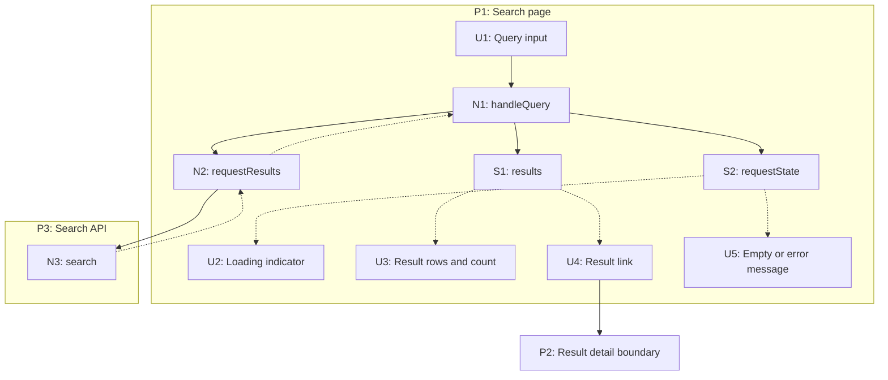

# Breadboarding examples and visual techniques

The [entrypoint](../SKILL.md) owns the schema and validation rules. This guide
adds whiteboard translation, detailed examples, chunking, and slice presentation.
All examples are illustrative designs, not claims about a repository.

## Translate a whiteboard

A whiteboard often puts a Place above a vertical stack of affordances. Floating
blocks between stacks may be code operations. Solid arrows normally indicate
calls, triggers, writes, or navigation; dashed arrows indicate returned/read data.
Check the drawing's legend before assuming these conventions.

1. Identify each Place and containing system boundary.
2. Assign stable P/U/N/S IDs; keep the drawing's labels as names, not extra IDs.
3. Map controls to U rows, executable steps to N rows, and state to S rows.
4. Capture containment in Place columns and arrows in the appropriate wiring
   column. A visual position is not a control-flow edge.
5. Record conditions and tentative labels (`?`, `~`, dashed borders) in Notes.
6. Record unclear arrows as open questions. Do not manufacture a missing call.
7. Reconcile the tables and then render the drawing from those tables.

A loader becomes an N row; its returned data feeds the relevant store or view.
A free-floating note is evidence or an annotation, not automatically an affordance.

## Places, subplaces, and local state

Use the interaction boundary, not a fixed widget taxonomy. A modal commonly
blocks the page behind it. Menus and popovers can be modal or nonmodal depending
on their actual behavior. A checkbox revealing fields usually changes local
state; an edit mode replacing the entire available control set may be a Place.
Backend execution and API boundaries can be Places even without a screen.

Use `P2.1` for a meaningful subplace of P2. Each affordance has one owning Place;
shared stores belong to a declared context that owns them, with explicit readers
and writers across boundaries. Keep all stores in the canonical Data stores
table, even when their Mermaid nodes are nested inside a Place.

A detached view of a complex subplace must keep the same IDs and reference the
same table rows. A label such as `_letter-browser` can describe a view reference,
but must not introduce a second, incompatible ID scheme. Showing a widget's
containment is not the same as navigating to it.

## Decide the level of detail

Model the steps needed to explain the requested outcome. An internal transform,
framework render call, or routing helper belongs in the model only when it has a
meaningful role at that level. Do not turn every line into a node or hide a
necessary authorization or failure boundary merely to simplify the picture.

Existing-system maps must cite code for their operations and edges. A proposed
operation can be named before implementation exists, provided it is labelled as
proposed. A coherent public operation may delegate internally and still be named
for its caller-visible effect.

Static text can have a constant source noted in its row. Dynamic displays need
an incoming data source. An operation with a terminal external effect can state
that effect in Notes; no imaginary store is needed just to make an outgoing edge.

## Example A: search and open a result

This proposed flow covers a query, loading, success, empty results, failure, and
navigation. N1 owns the current request: stale responses cannot replace newer
results. P2 is a declared destination whose detail-loading internals are outside
this example's scope.

### Places

| # | Place | Contains | Entry / Exit |
| --- | --- | --- | --- |
| P1 | Search page | Form, request orchestration, search state | Route load / select result |
| P2 | Result detail | Destination boundary only | Select result / return to search |
| P3 | Search API | Search endpoint | HTTP request / response |

### UI affordances

| # | Place | Component | Affordance | Control | Wires Out | Returns To |
| --- | --- | --- | --- | --- | --- | --- |
| U1 | P1 | search-form | Query input | type | -> N1 | — |
| U2 | P1 | search-status | Loading indicator | render | — | — |
| U3 | P1 | search-results | Result rows and count | render | — | — |
| U4 | P1 | search-results | Result link | click | -> P2 | — |
| U5 | P1 | search-status | Empty or error message | render | — | — |

### Code affordances

| # | Place | Component | Affordance | Control | Wires Out | Returns To | Notes |
| --- | --- | --- | --- | --- | --- | --- | --- |
| N1 | P1 | search-form | handleQuery | input | -> N2, -> S1, -> S2 | — | Debounce as required; set loading, ignore stale results, write success/empty/error state |
| N2 | P1 | search-client | requestResults | call | -> N3 | -> N1 | Return a success or error result |
| N3 | P3 | search-endpoint | search | HTTP request | — | -> N2 | Query internals omitted; return bounded results or a defined error |

### Data stores

| # | Place | Store | Description | Wires Out | Returns To |
| --- | --- | --- | --- | --- | --- |
| S1 | P1 | results | Current accepted result set | — | -> U3, -> U4 |
| S2 | P1 | requestState | Idle, loading, success, empty, or error | — | -> U2, -> U5 |

### Mermaid derived from these tables

Trace success as U1 -> N1 -> N2 -> N3, returned results through N2 to N1,
then N1 writes S1/S2, which feed U2-U5. Empty and failure follow the same
request path but produce different S2 states. Selecting U4 navigates to P2.

## Example B: scheduled import without UI

This operational workflow is a valid complete slice. Its observable outcome is
stored imported data plus a recorded result, not an invented screen.

### Places

| # | Place | Contains | Entry / Exit |
| --- | --- | --- | --- |
| P1 | Scheduler | Timer event | Scheduled time / dispatch |
| P2 | Import worker | Import orchestration and state | Dispatch / recorded outcome |
| P3 | Source API | Source records | Request / response |

### UI affordances

None: this workflow is driven by a scheduler.

### Code affordances

| # | Place | Component | Affordance | Control | Wires Out | Returns To | Notes |
| --- | --- | --- | --- | --- | --- | --- | --- |
| N1 | P1 | timer | dispatchImport | schedule | -> N2 | — | Supply a stable run identity |
| N2 | P2 | importer | importRecords | dispatch | -> N3, -> S1, -> S2 | — | Idempotent writes; on failure record error in S2 and leave checkpoint unchanged |
| N3 | P3 | source-client | fetchRecords | call | — | -> N2 | Return bounded source page or error |

### Data stores

| # | Place | Store | Description | Wires Out | Returns To |
| --- | --- | --- | --- | --- | --- |
| S1 | P2 | importedRecords | Source records keyed by stable identity | — | -> N2 |
| S2 | P2 | importCheckpoint | Last accepted cursor and run outcome | — | -> N2 |

### Trace and verification

N1 -> N2 -> N3 fetches a page. N3 returns to N2, which reads existing S1/S2
and commits accepted records and checkpoint consistently. Run the same input
twice: records must not duplicate. Inject a source failure: the prior checkpoint
must remain usable and S2 must report failure. The tables describe the proposed
contract; transaction and scheduler details require project evidence.

## Chunking a large diagram

Use a collapsed view only when readers can recover its underlying table IDs and
boundary edges. Prefer a clear entry point and output; do not conceal multiple
failure exits or shared state to make a subsystem appear simpler.

- Keep the full canonical tables.
- State the IDs included in the chunk and its incoming/outgoing edges.
- Use a separate detail view with the same IDs.
- Mark the chunk as a visual abbreviation, never as an extra executable node.
- Place annotations in a caption or workflow guide, not as unexplained dashed
  edges that could be mistaken for returned data.

Out-of-scope data flow can be labelled as abbreviated, but the table must record
the same abbreviation and evidence. A diagram may omit detail when explicitly
scoped; it may not add behavior absent from the model.

## Mermaid conventions

| Relationship | Syntax |
| --- | --- |
| Call, trigger, write, or navigation | `N1 --> N2` |
| Returned data or store read | `N2 -.-> N1` |
| Containment | Declared Place subgraph |

Use stable Place IDs for subgraphs. For hierarchical IDs, document a rendering
alias such as `P2_1` for `P2.1`. Quote labels and escape source-derived text rather
than interpolating arbitrary HTML or Mermaid directives. Use the renderer's
strict security mode. Colors are optional; labels and line styles must remain
understandable without color.

## Slicing the model

A slice delivers one coherent observable outcome. UI work can demonstrate an
interaction; backend, migration, CLI, or operational work can demonstrate a
request, data invariant, command result, or recovery behavior. Do not require UI
for a task that has none.

Assign each affordance to the slice where it first becomes available. Later
slices may reuse it; record that dependency without duplicating ownership.
Use V1, V2, and so on. Nine slices is a readability heuristic, not a correctness
limit; group a larger effort rather than merging unrelated outcomes to hit it.

For Example A:

| Slice | Mechanism | New affordances | Demo |
| --- | --- | --- | --- |
| V1 | Search with defined success and failure states | U1-U5, N1-N3, S1-S2 | Query, observe loading, open a result, and recover from a failed request |

A later pagination slice would add its real controls, handlers, and state after
updating the canonical tables. Do not claim a required V1 behavior is complete
while its wire is an unimplemented future stub. Label optional future controls
as unavailable until their slice exists.

## Final review

Apply the entrypoint's validation checklist. Then trace at least the happy path,
empty/error path, and any relevant retry, cancellation, concurrency, or restored
state behavior. For a map, compare those traces to code. For a design, record the
remaining assumptions and the test that will settle each one. Correct tables
before regenerating diagrams; implementation edits require an implementation
request.
