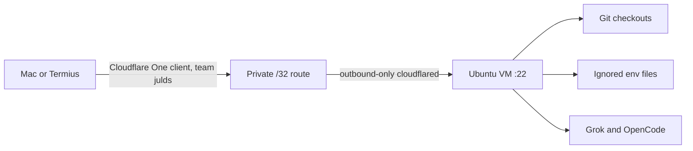
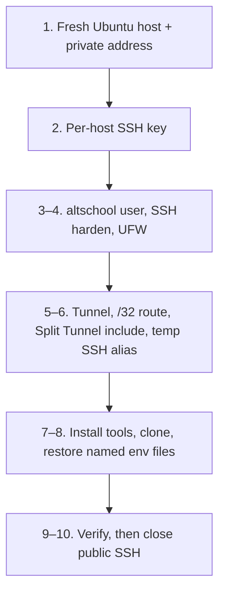

# Cloud Development Workspace Runbook

Last verified: 2026-08-31

This runbook documents the private Ubuntu development workspace currently
hosted on DigitalOcean and the provider-neutral procedure for rebuilding,
operating, migrating, and decommissioning it. The tracked dotfiles and
application Git repository are the source of truth. Provider snapshots are
optional recovery artifacts, not the primary deployment method.

## Start here

| Job | Section |
| --- | --- |
| Connect and work | [Daily access](#daily-access) |
| Confirm the host is healthy | [Verification](#verification) |
| Look up the live host | [Current deployment](#current-deployment) |
| Rebuild or change provider | [Build or rebuild a host](#build-or-rebuild-a-host), then [Provider migration](#provider-migration) |
| SSH, tunnel, or auth is broken | [Troubleshooting](#troubleshooting) |
| Stop paying for an idle host | [Cost control](#cost-control), then [Decommission checklist](#decommission-checklist) |

Rules that apply to every procedure: [Security invariants](#security-invariants).

<details>
<summary>Full contents</summary>

- [Architecture](#architecture)
- [Security invariants](#security-invariants)
- [Current deployment](#current-deployment)
- [Development environment](#development-environment)
- [Source files](#source-files)
- [Commands](#commands)
- [Daily access](#daily-access)
- [Verification](#verification)
- [Build or rebuild a host](#build-or-rebuild-a-host)
- [Termius configuration](#termius-configuration)
- [Provider migration](#provider-migration)
- [Cost control](#cost-control)
- [Maintenance](#maintenance)
- [Troubleshooting](#troubleshooting)
- [Decommission checklist](#decommission-checklist)
- [References](#references)

</details>

## Architecture



The Mac is the infrastructure control plane. DigitalOcean and Cloudflare
administrative credentials stay there. The VM is a replaceable development
worker with only the credentials needed for GitHub, Grok, OpenCode, and the
application.

The VM has no public inbound path. `cloudflared` establishes outbound
connections to Cloudflare, and the Cloudflare One Client routes the VM's
private `/32` through the tunnel.

## Security Invariants

- Do not add a permanent public SSH rule. Use a temporary source `/32` only
  while enrolling or recovering a host, then remove it.
- Keep the provider firewall at zero inbound rules after private access works.
- Permit SSH and Mosh in UFW only from the private network and loopback.
- Use the non-root `altschool` account with key-only authentication.
- Disable root, password, keyboard-interactive, and SSH agent-forwarding login.
  Keep local TCP forwarding for development ports.
- Keep infrastructure API tokens and infrastructure-control MCPs off the VM.
- Never copy GitHub, Grok, OpenCode, Cloudflare, or provider auth stores between
  hosts. Authenticate each host interactively and revoke old sessions.
- Generate a host-local personal GitHub SSH key on the VM
  (`~/.ssh/id_ed25519_personal`). Upload it twice: authentication and signing.
  Do not copy Mac private keys.
- Store ignored application environment files with mode `0600`. Transfer only
  explicitly named files and compare checksums.
- Install only Grok and OpenCode as coding agents on the VM.
- Grok and OpenCode intentionally use always-approve permissions. This is a
  deliberate trust decision for this private host, not a safe shared default.
- Never commit or document tunnel tokens, OAuth tokens, API keys, passwords,
  environment contents, account IDs, or device IDs.

## Current Deployment

Recheck this dated snapshot before relying on it during an incident or
migration.

| Item | Current value |
| --- | --- |
| Provider | DigitalOcean |
| Droplet | `altschool-dev` (`596565780`) |
| Region | `lon1` |
| Operating system | Ubuntu 24.04, x86_64 |
| Size | 4 vCPU, 8 GB RAM, 160 GB disk |
| Published plan cost at creation | Approximately USD 48/month |
| Monitoring | Enabled |
| Provider backups | Disabled |
| Provider firewall | `altschool-dev-firewall` (`6ff2f09f-f76f-4d17-8c9a-7b567eb27a7f`) |
| Provider firewall inbound | No rules |
| VPC | `10.106.0.0/20` |
| VM private address | `10.106.0.2` |
| Linux user | `altschool` |
| Cloudflare Zero Trust team | `julds` |
| Cloudflare tunnel | `altschool-dev`, healthy |
| Cloudflare private route | `10.106.0.2/32` to `altschool-dev` |
| Cloudflare connector | `cloudflared` 2026.8.3, active and enabled |
| Mac client | Cloudflare One Agent, connected as Cloudflare Zero Trust |
| Device routing | Split Tunnels Include mode with `10.106.0.2/32` included |
| Mac SSH alias | `altschool` |
| Termius address | `10.106.0.2`, user `altschool` |
| Application repository | `~/code/TalentQL/altschool-web-platforms` |
| Dotfiles repository | `~/code/personal/dotfiles` |

Powering off the Droplet does not end its compute charges. Destroy it when it
is no longer needed.

The Mac SSH alias disables agent forwarding and uses the dedicated key
`~/.ssh/id_ed25519_digitalocean_altschool`. Live sshd settings are in
`/etc/ssh/sshd_config.d/99-cloud-development.conf`: publickey-only
authentication, `AllowAgentForwarding no`, `AllowTcpForwarding local`,
and `X11Forwarding no`.

## Development Environment

The last verified core versions were:

| Tool | Version |
| --- | --- |
| Node | `v22.23.2` |
| Bun | `1.4.0` |
| Zsh | `5.9` |
| Starship | `1.26.0` |
| Grok | `1.0.13` |
| OpenCode | `1.18.25` |

The VM also has pnpm, uv, ast-grep, eza, bat, fzf, direnv, fd, tree,
ShellCheck, tmux, ripgrep, jq, GitHub CLI, and standard build tools.

Grok and OpenCode have only these MCPs:

- Context7 at `https://mcp.context7.com/mcp`
- Cloudflare Docs at `https://docs.mcp.cloudflare.com/mcp`
- Shadcn pinned to `shadcn@4.19.1`

OpenCode reads `agents/opencode/opencode.cloud.jsonc`, uses `xai/grok-4.6`,
allows autonomous operation, and denies reads of environment and known
credential paths. The cloud Zsh configuration starts Grok with the explicit
`--always-approve` flag. Grok has the same three MCPs.

## Source Files

| File | Responsibility |
| --- | --- |
| `scripts/setup_altschool_cloud.sh` | Installs the toolchain, optionally authenticates tools, clones the application, and runs verification |
| `scripts/install_cloud_dotfiles.sh` | Installs Ubuntu shell tools, pinned plugins, skills, git config, and agent configuration |
| `git/.gitconfig` | Shared Git config. Cloud installer links it and seeds personal identity files |
| `scripts/verify_altschool_cloud.sh` | Checks host identity, tools, resources, auth, tunnel service, and optional live model requests |
| `shell/.zshrc.cloud` | Cloud Zsh, history, aliases, PATH, direnv, and Starship setup |
| `agents/opencode/opencode.cloud.jsonc` | Cloud OpenCode model, MCP, permission, and credential-read policy |
| `~/.ssh/config` | Local private aliases and development port forwards; not managed by the cloud installer |

## Commands

From the Mac dotfiles checkout. `--host` defaults to `altschool`.

```bash
./scripts/setup_altschool_cloud.sh
./scripts/setup_altschool_cloud.sh --auth
./scripts/setup_altschool_cloud.sh --update --auth --repo TalentQL/altschool-web-platforms
./scripts/verify_altschool_cloud.sh --require-auth
./scripts/verify_altschool_cloud.sh --require-auth --smoke
```

`--smoke` makes two live model requests. On the VM, after the repo exists:

```bash
~/code/personal/dotfiles/scripts/install_cloud_dotfiles.sh
exec zsh
```

## Daily Access

1. Confirm the Cloudflare One Agent says `Connected` and uses the `julds` Zero
   Trust team.
2. Connect with `ssh altschool`.
3. Run `tmux new -As development` for work that must survive a disconnect.
4. Run `talentql` to enter the application repository.

The SSH alias forwards remote loopback ports 3000, 5173, and 8080 to the same
Mac loopback ports. Bind development servers to `127.0.0.1` on the VM unless a
tool requires another address.

Termius uses the same Cloudflare connection, address, user, and dedicated key.
Cloudflare One must be connected on the device running Termius.

## Verification

Run read-only verification from the local dotfiles checkout:

```bash
./scripts/verify_altschool_cloud.sh --require-auth
```

Use live model requests for a new host or auth diagnosis:

```bash
./scripts/verify_altschool_cloud.sh --require-auth --smoke
```

The smoke option incurs two small model requests. A healthy result has zero
failures. Check the application separately:

```bash
ssh -o ClearAllForwardings=yes altschool \
  'cd ~/code/TalentQL/altschool-web-platforms && bun run check && bun run check-types'
```

## Build or Rebuild a Host

Use a fresh Ubuntu image and the tracked scripts. Do not use a provider
snapshot as the default migration path because it also captures provider
configuration, old host keys, application secrets, and agent auth state.



Keep the old host unchanged until cutover. Details for a provider move are in
[Provider migration](#provider-migration).

### 1. Choose the Host

The provider must offer:

- Ubuntu 24.04 x86_64
- A stable private IPv4 address routable by `cloudflared`
- Outbound DNS, HTTPS, and Cloudflare Tunnel connectivity
- A stateful firewall with default-deny inbound behavior
- A serial or web console for lockout recovery
- At least 4 vCPU and 8 GB RAM for the verified workload
- Enough disk for repositories, dependencies, caches, and build outputs
- A region with acceptable latency from the usual Cloudflare One clients

The current 160 GB disk is generous. For a lower-cost replacement, measure
actual use with `df -h` and choose a smaller fresh disk with safe headroom.
Avoid expanding a provider disk unless needed because virtual disks commonly
cannot be shrunk in place.

Create a provider-private network and record its CIDR and the host's private
address. During migration, use a private address different from the old host so
both Cloudflare routes can coexist for testing.

### 2. Create a Per-Host SSH Key

Keep the old key and alias until cutover. Create a separate replacement key:

```bash
ssh-keygen -t ed25519 -f ~/.ssh/id_ed25519_PROVIDER_altschool \
  -C 'altschool development host'
chmod 600 ~/.ssh/id_ed25519_PROVIDER_altschool
```

Upload only the `.pub` file. Never upload or paste the private key into a
provider console.

### 3. Bootstrap the Linux User

Use the provider console or temporarily allow TCP 22 from the administrator's
current public `/32`. Keep the original session open until a second key-only
session succeeds.

As root:

```bash
adduser --disabled-password --gecos '' altschool
usermod -aG sudo altschool
install -d -m 0700 -o altschool -g altschool /home/altschool/.ssh
install -m 0600 -o altschool -g altschool /root/.ssh/authorized_keys \
  /home/altschool/.ssh/authorized_keys
printf '%s\n' 'altschool ALL=(ALL) NOPASSWD:ALL' \
  > /etc/sudoers.d/90-altschool
chmod 0440 /etc/sudoers.d/90-altschool
visudo -cf /etc/sudoers.d/90-altschool
```

Passwordless sudo is required by the unattended scripts. It increases the
impact of a compromised session, which is why the host has no public inbound
path and uses a dedicated key.

### 4. Harden SSH and the Host Firewall

Create `/etc/ssh/sshd_config.d/99-cloud-development.conf`:

```text
PermitRootLogin no
PasswordAuthentication no
KbdInteractiveAuthentication no
PubkeyAuthentication yes
AuthenticationMethods publickey
AllowAgentForwarding no
AllowTcpForwarding local
GatewayPorts no
X11Forwarding no
PermitTunnel no
```

Validate before reloading:

```bash
sudo sshd -t
sudo systemctl reload ssh
sudo sshd -T | grep -E \
  'permitrootlogin|passwordauthentication|kbdinteractiveauthentication|allowagentforwarding|allowtcpforwarding|authenticationmethods|x11forwarding'
```

Install base protections and add only the replacement provider's private CIDR.
Mosh uses UDP ports 60000 through 61000.

```bash
sudo apt-get update
sudo apt-get install -y fail2ban ufw
sudo ufw default deny incoming
sudo ufw default allow outgoing
sudo ufw allow from ADMIN_PUBLIC_IP/32 to any port 22 proto tcp
sudo ufw allow from NEW_PRIVATE_CIDR to any port 22 proto tcp
sudo ufw allow from NEW_PRIVATE_CIDR to any port 60000:61000 proto udp
sudo ufw enable
sudo systemctl enable --now fail2ban
sudo ufw status verbose
```

If the image has no swap, add a 4 GB swap file:

```bash
sudo fallocate -l 4G /swapfile
sudo chmod 600 /swapfile
sudo mkswap /swapfile
sudo swapon /swapfile
grep -q '^/swapfile ' /etc/fstab || \
  printf '%s\n' '/swapfile none swap sw 0 0' | sudo tee -a /etc/fstab
```

Keep the provider's temporary public SSH rule until Cloudflare access succeeds.

### 5. Create the Cloudflare Tunnel and Route

In the `julds` Cloudflare Zero Trust account:

1. Create a remotely managed tunnel named for the new host or provider.
2. Select the Linux installation instructions.
3. Run the one-time connector installation command on the VM.
4. Treat its tunnel token as a secret. Do not save it in this repository,
   tickets, notes, chat, or shell scripts.
5. Confirm `systemctl status cloudflared` and
   `systemctl is-enabled cloudflared` succeed.
6. Add `NEW_PRIVATE_IP/32` as a private route to the new tunnel.
7. Add `NEW_PRIVATE_IP/32` to the active Split Tunnels Include profile.
8. Keep the old route and include entry while testing the replacement.
9. Refresh or reconnect the Cloudflare One Agent if necessary.

Use a separate tunnel for a provider migration. Cloudflare replicas are useful
when every connector can reach the same private network. Two isolated providers
with different private addresses do not meet that condition.

### 6. Add a Temporary SSH Alias

Add a separate alias instead of changing `altschool` immediately:

```sshconfig
Host altschool-PROVIDER
  HostName NEW_PRIVATE_IP
  User altschool
  IdentityFile ~/.ssh/id_ed25519_PROVIDER_altschool
  IdentitiesOnly yes
  ForwardAgent no
  ServerAliveInterval 60
  ServerAliveCountMax 3
  LocalForward 127.0.0.1:3000 127.0.0.1:3000
  LocalForward 127.0.0.1:5173 127.0.0.1:5173
  LocalForward 127.0.0.1:8080 127.0.0.1:8080
  SendEnv COLORTERM TERM_PROGRAM
```

Verify effective settings and the host fingerprint:

```bash
ssh -G altschool-PROVIDER | grep -E \
  '^(hostname|user|identityfile|forwardagent|localforward) '
ssh altschool-PROVIDER
```

Accept a host key only after comparing its fingerprint with the provider
console. If a verified rebuild reuses an address, run
`ssh-keygen -R NEW_PRIVATE_IP`, then verify the new fingerprint.

### 7. Install Tools and Dotfiles

From the local dotfiles checkout:

```bash
./scripts/setup_altschool_cloud.sh \
  --host altschool-PROVIDER \
  --update \
  --auth \
  --repo TalentQL/altschool-web-platforms
```

The flow authenticates GitHub over HTTPS, Grok, and OpenCode with xAI
interactively without storing credentials in the script.

Clone and install the Linux dotfiles on the host:

```bash
ssh altschool-PROVIDER
mkdir -p ~/code/personal
git clone https://github.com/SomtoUgeh/dotfiles.git \
  ~/code/personal/dotfiles
~/code/personal/dotfiles/scripts/install_cloud_dotfiles.sh
exec zsh
```

If the repository already exists, update it with Git rather than deleting it.
The installer backs up conflicting linked files with a timestamp.

### 8. Restore Application Environment Files

Use the trusted source host. In the current deployment, three ignored
application environment files were transferred from the isolated OrbStack VM,
compared by SHA-256, and set to `0600`.

For each explicitly named file:

```bash
shasum -a 256 LOCAL_ENV_FILE
scp LOCAL_ENV_FILE altschool-PROVIDER:REMOTE_ENV_FILE.pending
ssh -o ClearAllForwardings=yes altschool-PROVIDER \
  'install -m 0600 REMOTE_ENV_FILE.pending REMOTE_ENV_FILE && rm REMOTE_ENV_FILE.pending && sha256sum REMOTE_ENV_FILE'
```

Compare hashes and quote real paths. Do not transfer these paths from the old
VM:

- `~/.config/gh`
- `~/.grok` auth data
- `~/.local/share/opencode/auth.json`
- Cloudflare tunnel service credentials
- Shell history
- The entire home directory

### 9. Verify the Replacement

```bash
./scripts/verify_altschool_cloud.sh \
  --host altschool-PROVIDER \
  --require-auth \
  --smoke

ssh -o ClearAllForwardings=yes altschool-PROVIDER \
  'cd ~/code/TalentQL/altschool-web-platforms && bun install --frozen-lockfile && bun run check && bun run check-types'
```

Also verify Termius, local forwards, both repositories' status, environment
file permissions, `cloudflared`, fail2ban, and UFW.

### 10. Close Public Access

After SSH and Termius work through Cloudflare:

1. Remove the temporary TCP 22 source `/32` from the provider firewall.
2. Remove any matching temporary public UFW rule.
3. Confirm the provider firewall has zero inbound rules.
4. Confirm a fresh private SSH session still succeeds.
5. Confirm the provider console remains available for recovery.

## Termius Configuration

| Field | Value |
| --- | --- |
| Address | Cloudflare-routed private IPv4 address |
| Port | `22` |
| Username | `altschool` |
| Key | Dedicated per-host Ed25519 key |
| Agent forwarding | Off |

Keep separate Termius entries for old and replacement hosts during migration.
Do not edit the working host until the replacement passes a connection test.
If Termius sync is enabled, review its key-storage and account-security settings
before importing a private key.

Mosh is optional. It requires UDP 60000 through 61000 over the private route.
Plain SSH inside tmux is the simpler fallback.

## Provider Migration

The safe migration is a parallel rebuild, not an in-place conversion.

### Prepare and Validate

1. Record resources, Cloudflare routes, tunnel health, profile includes, SSH
   aliases, Termius entries, disk use, and monthly cost.
2. Push intentional Git changes or preserve them separately. Do not assume a
   clean repository.
3. Inventory ignored application files without printing their contents.
4. Build the replacement with a new key, private address, tunnel, route, and
   temporary SSH alias. Keep the old host unchanged.
5. Authenticate services interactively on the replacement.
6. Transfer only required ignored files and compare checksums.
7. Run strict host verification and application checks.
8. Exercise Git, builds, local forwards, Grok, OpenCode, and Termius.
9. Confirm neither provider exposes a permanent public inbound rule.

### Cut Over

1. Change `altschool` in SSH config to the replacement address and key while
   keeping a temporary alias for the old host.
2. Update the main Termius host to the replacement address and key.
3. Open fresh SSH and Termius sessions using the primary names.
4. Stop making changes on the old host.
5. Check old checkouts one final time for uncommitted work and ignored files.

There is no DNS cutover. The client-visible switch is the private IP in SSH and
Termius.

### Remove the Old Path

1. Remove the old `/32` from the Cloudflare Include profile.
2. Delete the old Cloudflare private network route.
3. Stop the old connector and confirm the replacement remains reachable.
4. Delete the old tunnel after the rollback window.
5. Revoke old GitHub, Grok, and OpenCode sessions in their account consoles.
6. Destroy the old VM. Powering it off is not decommissioning.
7. Delete chargeable snapshots, volumes, reserved IPs, and other leftovers.
8. Remove obsolete SSH aliases, known-host entries, and Termius entries.
9. Archive or delete the old private key according to the rollback policy.
10. Check provider billing after its next usage update.

## Cost Control

The current DigitalOcean plan was approximately USD 48/month at creation. Use
the provider's current pricing page and invoice as authoritative.

- Enable provider spend alerts and review spend after provisioning, resizing,
  snapshotting, or destroying resources.
- Destroy idle development VMs instead of powering them off.
- Keep provider backups disabled unless their recovery value justifies cost.
- Give each snapshot a deletion date. DigitalOcean currently documents snapshot
  storage at USD 0.06 per GB per month.
- Measure `free -h`, `df -h`, build duration, and CPU load before downsizing.
- Prefer a fresh smaller disk over enlarging and later trying to shrink a disk.
- Delete unattached volumes, reserved IPs, abandoned tunnels, and snapshots.
- Include region, support, networking, firewall, and transfer costs in
  comparisons, not only the headline VM price.

Compare equivalent shared-vCPU Ubuntu instances from DigitalOcean, Hetzner
Cloud, Akamai/Linode, and Vultr. Hetzner positions shared plans for development
and test workloads and provides private networks and stateful firewalls, but
region, account approval, support, and measured performance still matter.

## Maintenance

Weekly or before important work:

```bash
ssh -o ClearAllForwardings=yes altschool \
  'uptime; free -h; df -h; systemctl is-active cloudflared fail2ban; sudo ufw status'
./scripts/verify_altschool_cloud.sh --require-auth
```

Update packages and agents:

```bash
./scripts/setup_altschool_cloud.sh --update
ssh -o ClearAllForwardings=yes altschool \
  'test ! -f /var/run/reboot-required || cat /var/run/reboot-required.pkgs'
```

Schedule a reboot when required, reconnect, and verify. Do not update tunnel,
SSH, firewall, and Cloudflare client configuration simultaneously.

Monthly:

- Review provider spend and resources.
- Review Cloudflare connectors, routes, and device-profile includes.
- Remove obsolete device and OAuth sessions.
- Check disk growth from caches and build outputs.
- Confirm provider console recovery works.
- Confirm the SSH key is present only on intended client devices.
- Compare current cost with one realistic replacement provider.

## Troubleshooting

### SSH Times Out

Check in order:

1. Cloudflare One Agent is connected to team `julds`.
2. The target `/32` is in the active Include profile.
3. The route points to the expected healthy tunnel.
4. The provider console shows the VM running.
5. `cloudflared` is active.
6. UFW permits TCP 22 from the private CIDR.
7. The provider firewall has no conflicting configuration.

Use the provider console for server checks. Do not permanently open public SSH.

### Cloudflare Client Disrupts Mac Networking

Keep the working Cloudflare One Agent. Do not install consumer Cloudflare WARP
or `warp-cli`. Refresh or reconnect the existing app first, and record old
route/profile values before changing them.

### Host Key Warning

Stop and verify whether the host was deliberately rebuilt. Compare the new
fingerprint through the provider console before removing a `known_hosts` entry.

### Tunnel Is Down

Use the provider console:

```bash
sudo systemctl status cloudflared
sudo journalctl -u cloudflared --since '30 minutes ago'
sudo systemctl restart cloudflared
```

Rotate tunnel credentials in Cloudflare if the token may be compromised.

### Authentication Fails

```bash
./scripts/verify_altschool_cloud.sh --require-auth
./scripts/setup_altschool_cloud.sh --host HOST_ALIAS --auth
```

Do not inspect or paste raw credential files into chat or tickets.

### Environment File Is Missing

Recover the named file from the trusted source, transfer it to a temporary
name, install it with mode `0600`, compare SHA-256, and rerun application checks.
Do not recover all hidden files as a bundle.

### Locked Out by SSH or UFW

Use the provider console. Validate `sshd` before reloading. If necessary,
temporarily add TCP 22 from the administrator's current public `/32`, repair and
test key-only access, then remove the rule from UFW and the provider firewall.

## Decommission Checklist

- [ ] Replacement passes strict host verification and model smoke tests.
- [ ] Application checks pass on the replacement.
- [ ] SSH, Termius, and local forwards work through Cloudflare One.
- [ ] Git status is understood on old application and dotfiles checkouts.
- [ ] Required ignored files were transferred by explicit path and checksum.
- [ ] Primary SSH and Termius definitions point to the replacement.
- [ ] Replacement provider firewall has zero inbound rules.
- [ ] Old Cloudflare include, route, connector, and tunnel were removed after
      the rollback window.
- [ ] Old service sessions were revoked.
- [ ] Old VM and chargeable attached resources were destroyed.
- [ ] Old provider billing was checked after destruction.
- [ ] Obsolete keys and host entries were removed or retained for a documented
      rollback period.

## References

- [Cloudflare Tunnel availability and replicas](https://developers.cloudflare.com/cloudflare-one/networks/connectors/cloudflare-tunnel/configure-tunnels/tunnel-availability/)
- [Cloudflare private network routes](https://developers.cloudflare.com/cloudflare-one/networks/connectors/cloudflare-tunnel/get-started/create-remote-tunnel-api/)
- [Cloudflare Split Tunnels](https://developers.cloudflare.com/cloudflare-one/team-and-resources/devices/cloudflare-one-client/configure/route-traffic/split-tunnels/)
- [Cloudflare SSH with the device client](https://developers.cloudflare.com/cloudflare-one/networks/connectors/cloudflare-tunnel/use-cases/ssh/ssh-device-client/)
- [DigitalOcean Droplet details](https://docs.digitalocean.com/products/droplets/details/)
- [DigitalOcean billing](https://docs.digitalocean.com/platform/billing/)
- [DigitalOcean snapshots](https://docs.digitalocean.com/products/snapshots/details/)
- [Hetzner Cloud](https://www.hetzner.com/cloud/)
